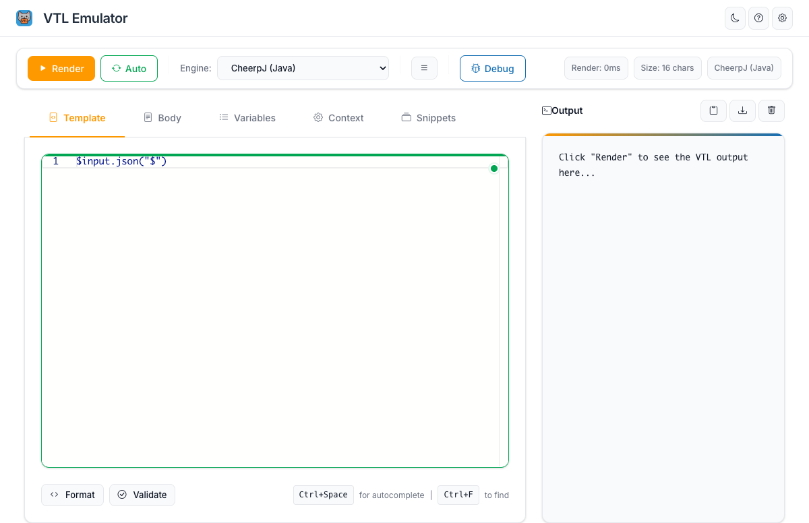
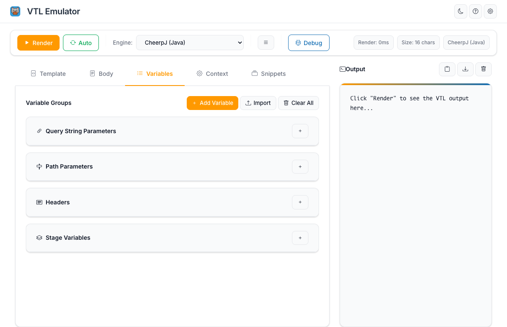
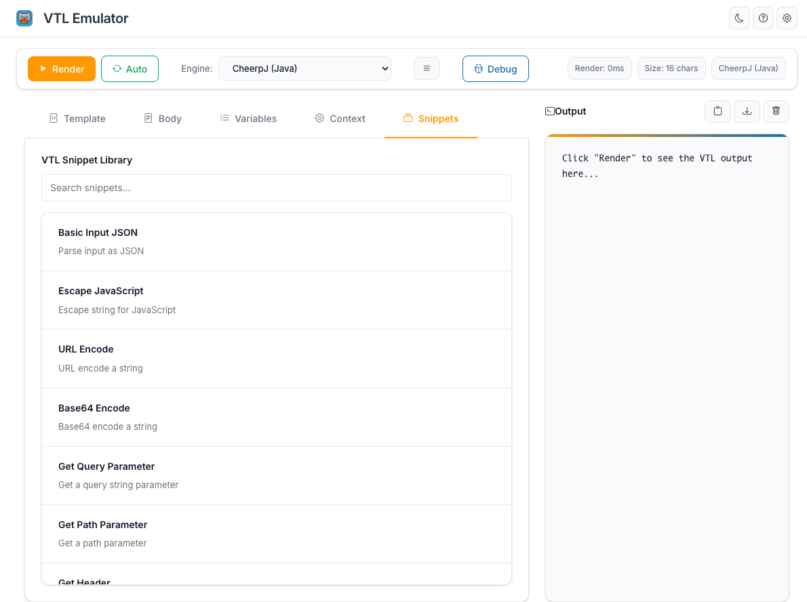
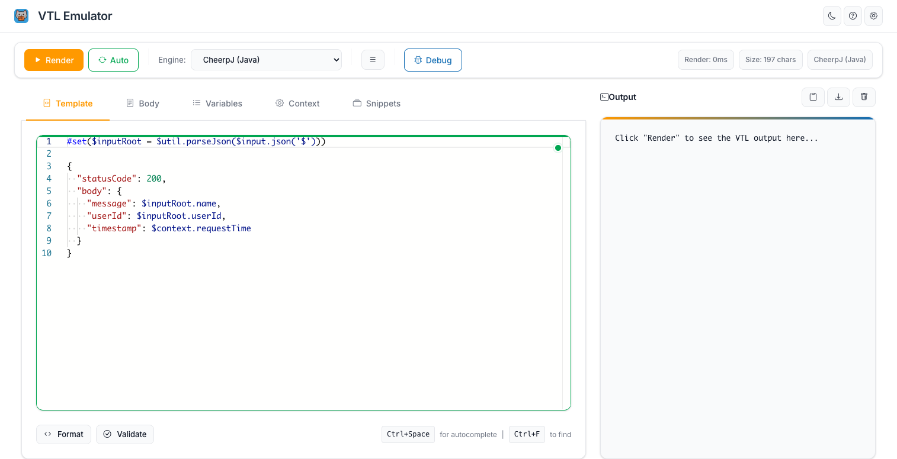
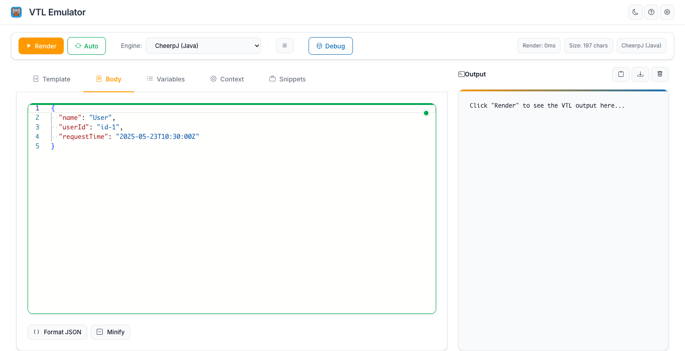
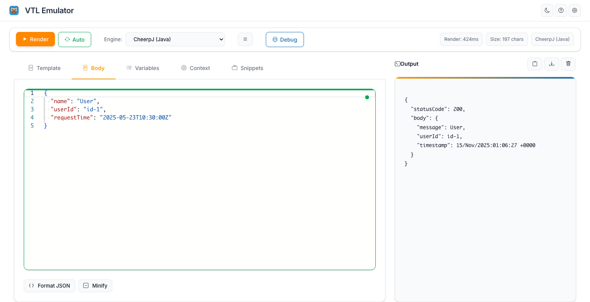

# VTL Emulator Pro

**VTL Emulator Pro** is a browser-based editor and emulator
for [Apache Velocity Template Language (VTL)](https://velocity.apache.org/engine/1.7/user-guide.html), designed to
simulate AWS API Gateway integration request/response templates.

---

## 🔍 What is this?

This tool lets you:

- Write and preview VTL templates live
- Simulate `$input`, `$util`, and `$context` variables
- Render and debug request/response flows
- Manage variables for headers, query params, stage variables, and paths
- Quickly test conditional blocks, loops, and transformations
- **Choose between multiple VTL engines** (CheerpJ Java engine or Vela JavaScript engine)

---

## 🌐 Try it online

👉 **[https://vtlemulator.dev](https://vtlemulator.dev)**

⚠️ **No data is ever sent to any backend.** Everything runs 100% in your browser. Perfect for privacy-sensitive
workflows.

---

## 🚀 Engine Selection

The VTL Emulator supports multiple underlying engines for processing VTL templates:

### CheerpJ (Java) Engine
- **Type**: Java-based VTL processor running in browser via CheerpJ
- **Performance**: Medium
- **Size**: Large
- **Features**: Full Java compatibility, AWS API Gateway functions, JSONPath support
- **Best for**: Maximum compatibility with AWS API Gateway VTL behavior

### Vela (JavaScript) Engine ⚠️ Experimental - Coming Soon
- **Type**: Pure JavaScript VTL processor
- **Performance**: Fast
- **Size**: Small
- **Features**: Pure JavaScript, Fast execution, Small bundle size, Modern ES6+
- **Best for**: Fast development and testing
- **Status**: Experimental, coming soon

You can switch between engines using the dropdown in the toolbar. The engine selection is preserved across sessions.

---

## 📁 Repository Structure

This repository contains:

| Path               | Description                                      |
|--------------------|--------------------------------------------------|
| `/index.html`      | Redirect page to the new website                |
| `/frontend/`       | React-based frontend application                 |
| `/emulator/`       | The standalone VTL engine used by the UI and NPM |
| `/img.png`         | Screenshot used in documentation                 |
| `/CONTRIBUTING.md` | Contribution guide for engine and UI development |

You can contribute to either the visual interface or the evaluation engine.

---

## 🧰 Features

- 🖊️ Monaco-based editor with syntax highlighting and autocompletion
- 📦 Snippets for common AWS API Gateway use-cases
- 📄 Compare VTL templates side-by-side
- 📥 Import/export template configurations
- 🎨 Light/Dark theme toggle
- 📋 Output preview with copy/share/download support
- 🔍 Debug panel showing render steps

---

## 📘 Screenshots

### Main Interface

The VTL Emulator provides a clean, intuitive interface with a Monaco-based code editor, real-time rendering, and comprehensive debugging tools.



### Variables Management

Easily manage query string parameters, path parameters, headers, and stage variables through an organized interface.



### Code Snippets Library

Access a comprehensive library of pre-built VTL snippets for common AWS API Gateway use cases, including input parsing, error handling, and Step Functions integration.



### Example Usage

Here's a simple example showing how to use the VTL Emulator:

**1. Write your VTL template** - Create a template that processes input data and generates a response:



**2. Configure your input body** - Add JSON data that will be processed by the template:



**3. Render and view output** - Click the Render button to see the processed output:



The example above shows a VTL template that:
- Parses JSON input using `$util.parseJson($input.json('$'))` to convert the input string to a JSON object
- Accesses parsed input fields like `$inputRoot.name` and `$inputRoot.userId`
- Uses context variables like `$context.requestTime` for request metadata
- Generates a formatted JSON response with status code and body containing the processed data

---

## 🚀 Quick Start (for the UI)

The frontend is a React application. To run it locally:

```bash
git clone https://github.com/fearlessfara/apigw-vtl-emulator.git
cd apigw-vtl-emulator/frontend
npm install
npm run dev
```

Or visit the live version at **[https://vtlemulator.dev](https://vtlemulator.dev)**

---

## 🤝 Contributing

See [CONTRIBUTING.md](./CONTRIBUTING.md) for full guidelines on contributing to either the UI or engine.

---

## 📝 License

MIT — © 2025 [Christian Gennaro Faraone](https://github.com/fearlessfara)
