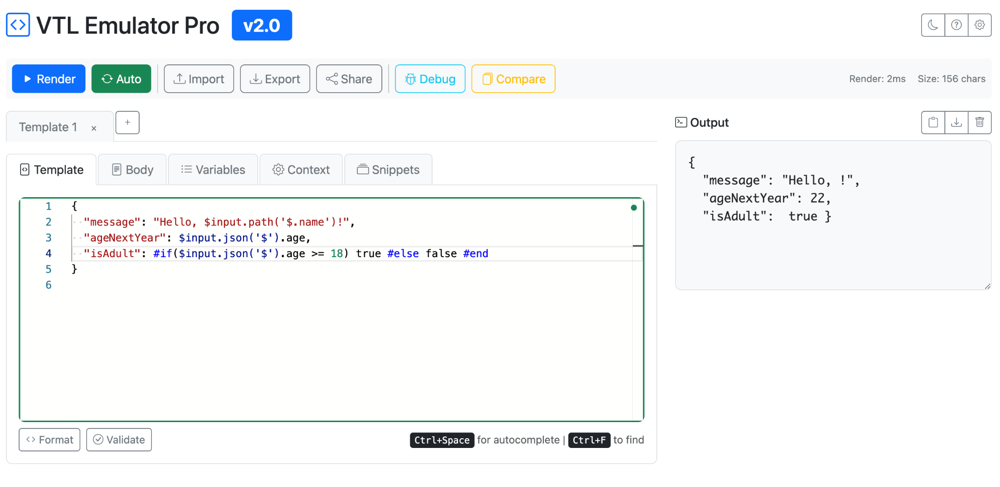

# VTL Emulator Pro

**VTL Emulator Pro** is a browser-based editor and emulator for [Apache Velocity Template Language (VTL)](https://velocity.apache.org/engine/1.7/user-guide.html), designed to simulate AWS API Gateway integration request/response templates.

## 🔍 What is this?

This tool lets you:
- Write and preview VTL templates live
- Simulate `$input`, `$util`, and `$context` variables
- Render and debug request/response flows
- Manage variables for headers, query params, stage variables, and paths
- Quickly test conditional blocks, loops, and transformations

## 🌐 Try it online

The web version is available at:

👉 **[https://fearlessfara.github.io/apigw-vtl-emulator](https://fearlessfara.github.io/apigw-vtl-emulator)**

⚠️ **No data is ever sent to any backend.** Everything runs 100% in your browser. Perfect for privacy-sensitive workflows.

---

## 📁 Repository Structure

This repository contains **both**:

- 🖥️ **The website**, which is hosted via GitHub Pages at [https://fearlessfara.github.io/apigw-vtl-emulator](https://fearlessfara.github.io/apigw-vtl-emulator)
- 🧩 **The library/engine code**, found in the `emulator/` folder, and published on NPM as [`apigw-vtl-emulator`](https://www.npmjs.com/package/apigw-vtl-emulator)

You can contribute to either part — feel free to improve the UI, fix bugs in the engine, or add new template utilities.

Happy templating! 🎉

---

## 🧰 Features

- 🖊️ Monaco-based editor with syntax highlighting and autocompletion
- 📦 Snippets for common AWS ApiGateway use-cases
- 📄 Compare VTL templates side-by-side
- 📥 Import/export template configurations
- 🎨 Light/Dark theme support
- 📋 Render outputs, copy/share/download results
- 🔍 Debug panel for rendering steps


## 📘 Example



## ⚙️ JavaScript Engine

This project includes a fully browser-compatible JavaScript engine that emulates AWS API Gateway's VTL behavior.

- **NPM:** [https://www.npmjs.com/package/apigw-vtl-emulator](https://www.npmjs.com/package/apigw-vtl-emulator)

- **CDN:** [https://cdn.jsdelivr.net/npm/apigw-vtl-emulator@1.0.0/dist/vtl.mjs](https://cdn.jsdelivr.net/npm/apigw-vtl-emulator@1.0.0/dist/vtl.mjs)

The engine runs entirely in the browser and **does not send any data to a backend**, making it an excellent choice for privacy-sensitive debugging and development.


## 🚀 Quick Start

Clone the repository and open `index.html` in your browser:

```bash
git clone https://github.com/fearlessfara/apigw-vtl-emulator.git
cd vtl-emulator
open index.html # or use a local server

```

## 🧠 Engine Internals & Contributions

The core VTL evaluation logic is inside the `emulator/` folder and is composed of:

### 📄 `engine.js`

This file is the main entry point. It:

- Parses the Velocity template.
- Normalizes the incoming event into a usable context (`$input`, `$context`, `$util`, etc.).
- Compiles and renders the VTL using `velocityjs` with custom handlers.

You interact with it via the `renderVTL(template, event)` function, where:
- `template` is your VTL string.
- `event` is an object that mimics an API Gateway request.

### ⚙️ `handlers.js`

This file defines custom method handlers to simulate AWS API Gateway VTL behavior, including:

- `$input.params().header`, `$input.json('$')`, `$input.path()`
- `$util.base64Encode`, `$util.escapeJavaScript`, `$util.urlEncode`, etc.
- `$context.*` mappings to simulate AWS context

These handlers are injected into the Velocity runtime and allow accurate emulation of API Gateway VTL expressions.

---

## 🤝 Contributing

Merge Requests are more than welcome! To contribute:

1. Clone the repo and create a new branch.
2. Add features or fix bugs in the `emulator/` folder.
3. Write **unit tests** for every new handler or behavior.

Tests should go inside the `emulator/tests/` folder.

✅ Only well-tested contributions will be merged.

Make sure your tests:
- Cover both valid and edge-case scenarios.
- Use realistic `event` payloads that mimic API Gateway requests.
- Assert expected outputs clearly and concisely.

Once you're done, open a merge request — we love good contributions!